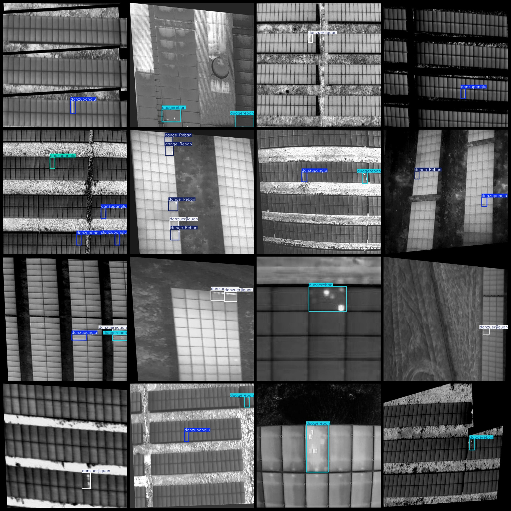
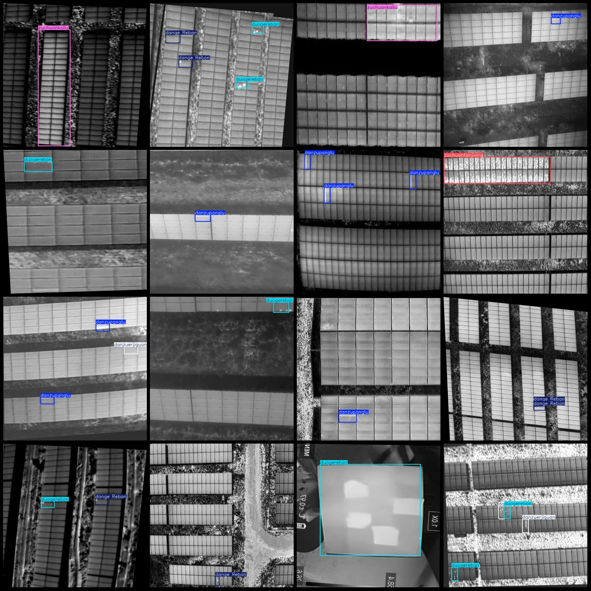

# Drone-Viewed Photovoltaic Module Thermal Imaging Defect Detection Dataset (VOC+YOLO Format) - 7332 Images, 8 Categories with Augmentation

Please note that the dataset contains a large number of enhanced images, mainly rotation enhancements, as can be seen in the images.

The dataset format includes Pascal VOC format and YOLO format (without the split path in the txt file, only containing JPG images and corresponding VOC format xml files and YOLO format txt files).

Number of images (in jpg files): 7332
Number of annotations (xml files): 7332
Number of annotations (txt files): 7332
Number of categories: 8
Category names according to the labels folder's classes.txt: ["Single Heatspot", "Single Diode", "Single Parallel", "Multiple Heatspots", "Groups of Diodes", "Groups of Parallels", "Parallel Reversed 
Polarities", "Parallel Open Circuit"]

Each category has been labeled with boxes:

- Single Heatspot Boxes: 7636
- Single Diode Boxes: 1982
- Single Parallel Boxes: 3252
- Multiple Heatspots Boxes: 5297
- Groups of Diodes Boxes: 1047
- Groups of Parallels Boxes: 391
- Parallel Reversed Polarities Boxes: 124
- Parallel Open Circuit Boxes: 1266
Total Boxes: 20995

Images per category:
- Single Heatspot Images: 2549
- Single Diode Images: 1140
- Single Parallel Images: 1903
- Multiple Heatspots Images: 3109
- Groups of Diodes Images: 559
- Groups of Parallels Images: 338
- Parallel Reversed Polarities Images: 110
- Parallel Open Circuit Images: 623

Image resolution: 640x640
Drone: DJI MAVIC 3
Collection height: 40~120m
Collection angle: 0~90°
Annotation tool used: labelImg
Annotation rules: Draw bounding boxes for each category
Important Notice: The dataset does not have been split into training, validation, and test sets; users are required to do so themselves.
Special Notice: This dataset does not guarantee the accuracy of the trained models or weight files.
Image previews:

## Images

Here is a pay link on Stripe ( https://buy.stripe.com/3cs8yP7sY87d0vu9AB ). Please contact me lonlonago@foxmail.com after funding $89, and I will send you a complete data files , thank you!

